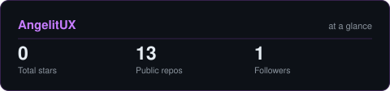
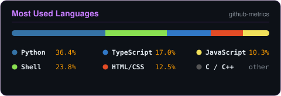

<div align="center">

  <!-- ==================== BANNER (DARK / LIGHT DUAL THEME) ==================== -->
  <picture>
    <source media="(prefers-color-scheme: dark)" srcset="assets/banner-dark.svg">
    <source media="(prefers-color-scheme: light)" srcset="assets/banner-light.svg">
    
  </picture>

  <!-- ==================== ANIMATED TYPING EFFECT ==================== -->
  <p align="center">
    <a href="https://github.com/AngelitUX">
      
    </a>
  </p>

  <!-- ==================== SOCIAL / CONTACT BADGES ==================== -->
  <p align="center">
    <a href="https://www.linkedin.com/in/angelgpinoc/">
      
    </a>
    <a href="mailto:angelgpinoc@gmail.com">
      
    </a>
    <a href="https://github.com/AngelitUX">
      
    </a>
    <a href="https://www.credly.com/organizations/cisco/badges">
      
    </a>
    
  </p>

</div>

---

###  Telemetría // Perfil Profesional

> *Estudiante de 10º semestre de **Ingeniería Civil Informática** en la **Universidad de Valparaíso**, con enfoque en **Ciberseguridad Defensiva**, **Infraestructura de Redes** y **Administración de Sistemas Linux**.*

Actualmente enfoco mi desarrollo profesional en la **seguridad informática defensiva**, el **análisis de vulnerabilidades (OWASP Top 10)**, el **hardening de entornos Linux** y el diseño e implementación de **redes seguras**. Cuento con experiencia práctica en desarrollo web full-stack modular y soporte técnico de infraestructura de red en el sector público.

* **Ubicación:** Valparaíso, Chile.
* **Formación:** Licenciatura en Ciencias de la Ingeniería (Universidad de Valparaíso) · Egresando 2026.
* **Certificaciones Cisco Networking Academy:**
  * *Ethical Hacker* (En curso, 2026)
  * *Introduction to Cybersecurity* (2026)
* **LinkedIn:** [www.linkedin.com/in/angelgpinoc](https://www.linkedin.com/in/angelgpinoc/)
* **Filosofía:** Seguridad por diseño, mínimos privilegios y automatización reproducible.

---

###  Arsenal Tecnológico

<div align="center">
  <a href="https://skillicons.dev">
    
  </a>
</div>

<br>

| Categoría | Tecnologías y Herramientas |
| :--- | :--- |
| **Sistemas & Terminal** | Linux (Ubuntu, Debian, Kali), Bash Scripting, Systemd, Cron, SSH, Permissions & Hardening |
| **Redes & Conectividad** | TCP/IP, DNS, DHCP, HTTP/HTTPS, Diagnóstico LAN, Enrutamiento, Nmap, Wireshark |
| **Seguridad Defensiva** | OWASP Top 10, Políticas de Acceso (RBAC), Reglas de Firewall (iptables), Análisis de Vulns |
| **Contenedores & DevOps** | Docker, Docker Compose, Git, GitHub Actions, CI/CD pipelines básicos |
| **Lenguajes & Backend** | Python (Automatización/Scripting), TypeScript, JavaScript, NestJS, APIs RESTful, C / C++ |
| **Bases de Datos** | PostgreSQL, MongoDB, MySQL |

---

###  Radar de Habilidades y Stack Técnico

Los siguientes gráficos son generados vectorialmente de forma nativa vía **Python** y **GitHub Actions** en base a los modelos de telemetría de este repositorio:

<table align="center" width="100%">
  <tr>
    <th width="50%" align="center"><b>🛡️ Capacidades en Seguridad &amp; Sistemas</b></th>
    <th width="50%" align="center"><b>💻 Lenguajes &amp; Herramientas Clave</b></th>
  </tr>
  <tr>
    <td align="center">
      <picture>
        <source media="(prefers-color-scheme: dark)" srcset="assets/radar-dark.svg">
        <source media="(prefers-color-scheme: light)" srcset="assets/radar-light.svg">
        
      </picture>
    </td>
    <td align="center">
      <picture>
        <source media="(prefers-color-scheme: dark)" srcset="assets/radar-langs-dark.svg">
        <source media="(prefers-color-scheme: light)" srcset="assets/radar-langs-light.svg">
        
      </picture>
    </td>
  </tr>
</table>

---

###  Actividad y Estadísticas en GitHub

Tarjetas de estadísticas autohospedadas y libres de dependencias externas caídas, renderizadas por el workflow programado:

<div align="center">
  <table align="center">
    <tr>
      <td align="center">
        <picture>
          <source media="(prefers-color-scheme: dark)" srcset="assets/card-stats-dark.svg">
          <source media="(prefers-color-scheme: light)" srcset="assets/card-stats-light.svg">
          
        </picture>
      </td>
      <td align="center">
        
      </td>
    </tr>
  </table>
</div>

---

###  Experiencia Práctica Destacada

```
┌──[ EstudiaUni.cl ] - Plataforma Universitaria Modular
│   • Rol: Desarrollador Full-Stack (Angular, NestJS, MongoDB/PostgreSQL)
│   • Implementación de arquitectura modular y consumo seguro de APIs RESTful.
│   • Autenticación robusta y diseño de esquemas seguros.
└──
┌──[ Dirección de Vialidad - MOP ] - Soporte Técnico e Infraestructura
│   • Mantenimiento y diagnóstico de redes LAN, direccionamiento y resolución de incidencias.
│   • Configuración de permisos de usuario, software corporativo y respaldo de información crítica.
└──
```

---

<div align="center">
  <sub><i>“In a city run by code and chrome, the only real firewall is how fast you can think.”</i></sub>
</div>
